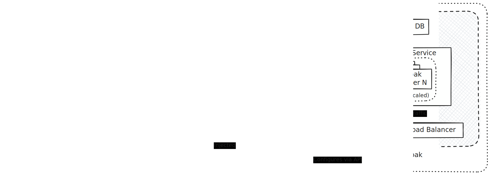

# VEDA Keycloak

An experimental Keycloak deployment for the VEDA project.

## Development

- `keycloak-config-cli/config` - Configuration YAML files.
- `keycloak/providers` - Custom Service Provider Interfaces.
- `keycloak/themes` - Custom Keycloak themes.

### Architecture



### Configuration

We currently make use of the [keycloak-config-cli](https://github.com/adorsys/keycloak-config-cli) to apply configuration at time of deployment.

> `keycloak-config-cli` is a Keycloak utility to ensure the desired configuration state for a realm based on a JSON/YAML file. The format of the JSON/YAML file based on the export realm format.

Configuration is stored within `keycloak-config-cli/config` in YAML files for each Keycloak realm managed.

> [!IMPORTANT]
> At each deployment, the keycloak-config-cli will likely overwrite changes made outside of the configuration stored within this repository for a given realm.

#### Creating Clients

Creating a client application within Keycloak is done by editing the config YAML for the realm.

##### Public Client

A minimum example of a public client (ie a client that only runs within the frontend, such as single page application):

```yaml
clients:
  - clientId: grafana
    name: Grafana
    publicClient: true
    rootUrl: https://example.com
    redirectUris:
      - https://example.com/*
    webOrigins:
      - https://example.com
    protocol: openid-connect
    fullScopeAllowed: true
```

##### Private Client

For a private client (ie a client that runs within the frontend, such as single page application), a secret will automatically be created and injected into the configuration runtime environemt at time of deployment. This secret will be made avaiable at an environment variable of `$SLUG_CLIENT_SECRET` where `$SLUG` represents a slugify version of the `clientId` value (e.g. a client with an id of `stac-api` will have a secret available at `STAC_API_CLIENT_SECRET`).

A minimum example of a private client (note `publicClient: false` and `secret`):

```yaml
clients:
  - clientId: grafana
    name: Grafana
    publicClient: false
    secret: $(env:GRAFANA_CLIENT_SECRET)
    rootUrl: https://example.com
    redirectUris:
      - https://example.com/*
    webOrigins:
      - https://example.com
    protocol: openid-connect
    fullScopeAllowed: true
```

##### Scopes, Roles, and Groups

Clients will typically have associated Scopes, Roles, and Groups.

- Scopes can be thought of as individual permissions used by a client.
- Roles are collections of permissions that enable a typical function (e.g. system administration)
- Groups are collections of users that we want to grant with roles.

An example of a client with associated scopes, roles, & groups:

```yaml
clients:
  - clientId: grafana
    # ... omitted for brevity
    fullScopeAllowed: true
    defaultClientScopes:
      - web-origins
      - acr
      - profile
      - roles
      - basic
      - email
      - grafana:admin
      - grafana:editor
      - grafana:viewer

roles:
  client:
    grafana:
      - name: Administrator
        description: Grafana Administrator
      - name: Editor
        description: Grafana Editor
      - name: Viewer
        description: Grafana Viewer

clientScopeMappings:
  grafana:
    - clientScope: grafana:admin
      roles:
        - Administrator
    - clientScope: grafana:editor
      roles:
        - Editor
    - clientScope: grafana:viewer
      roles:
        - Viewer

clientScopes:
  - name: grafana:admin
    description: Admin access to Grafana
    protocol: openid-connect
  - name: grafana:editor
    description: Editor access to Grafana
    protocol: openid-connect
  - name: grafana:viewer
    description: Viewer access to Grafana
    protocol: openid-connect

groups:
  - name: System Administrators
    clientRoles:
      grafana:
        - Administrator

  - name: Developers
    clientRoles:
      grafana:
        - Editor

  - name: Data Editors
    clientRoles:
      grafana:
        - Viewer
```

#### Identity Provider OAuth Clients

When a third party service operates as an Identity Provider (IdP, e.g. CILogon or GitHub) for Keycloak, we must register that IdP within the Keycloak configuration. This involves registering the IdP's OAuth client ID and client secret within Keycloak's configuration (along with additional information about the OAuth endpoints used within the login process).

At time of deployment, environment variables starting with `IDP_SECRET_ARN_` will be treated as ARNs to Secrets stored within AWS Secrets Manager. These secrets should be JSON objects containing both an `id` and `secret` key. These values will be injected into the docker instance running the Keycloak Config CLI, making them avaiable under `{CLIENTID}_CLIENT_ID` and `{CLIENTID}_CLIENT_SECRET` environment variables, allowing for their usage within a Keycloak configuration YAML file.

<details>

<summary>Example of injecting an IdP OAuth2 Client Secret</summary>

For this example, let's imagine we're attempting to insert the Client ID and Client Secret for a Github Identity Provider. To achieve this, we would take the following steps:

1. Submit these values to AWS Secrets Manager:

   ```sh
   $ aws secretsmanager \
      create-secret \
      --name veda-keycloak-github-idp-creds \
      --secret-string '{"id": "cl13nt1d", "secret": "cl13ntS3cr3t!"}'
   ```

   AWS will respond with the ARN of the newly created Secret.

1. Register the secret with the Github environment, named `IDP_SECRET_ARN_$CLIENTID`, where `$CLIENTID` is a unique identifier for that IDP (for this example, we'll use `GH`). This can be done via the Github CLI if run from within the project repo:

   ```sh
   # Add variable value for the current repository in an interactive prompt
   $ gh variable set IDP_SECRET_ARN_GH --env dev
   ```

1. Update the Github Actions workflow to inject this variable into the runtime environment when calling `cdk deploy`:

   ```diff
    - name: Deploy CDK to dev environment
      run: |
         cdk deploy --require-approval never --outputs-file outputs.json
      env:
         # ...
   +     IDP_SECRET_ARN_GH: ${{ vars.IDP_SECRET_ARN_GH }}
   ```

1. The `id` and `secret` will now be available when configuring Keycloak. We can add a secrtion like the following to make use of these variables with `keycloak-config-cli/config/master.yaml`:

   ```yaml
   identityProviders:
   # GitHub with Org Check
   - alias: github-org-check # NOTE: this alias appears in the redirect_uri for the auth flow, update Github OAuth settings accordingly
      displayName: GitHub [NASA-IMPACT]
      providerId: github-org
      enabled: true
      updateProfileFirstLoginMode: on
      trustEmail: false
      storeToken: false
      addReadTokenRoleOnCreate: false
      authenticateByDefault: false
      linkOnly: false
      config:
         clientId: $(env:GH_CLIENT_ID)
         clientSecret: $(env:GH_CLIENT_SECRET)
         defaultScope: openid read:org user:email
         organization: nasa-impact
         caseSensitiveOriginalUsername: "false"
         syncMode: FORCE
   ```

</details>

### Service Provider Interfaces

Beyond configuration, customization of Keycloak (e.g. a custom Identity Providers) may require development of custom Service Provider Interfaces (SPIs).

> [!TIP]
> See the Service Provider Interfaces section in the [Server Developer Guide](https://www.keycloak.org/docs/latest/server_development/#_providers) for more details about how to create custom themes.

### Themes

> [!TIP]
> See the theme section in the [Server Developer Guide](https://www.keycloak.org/docs/latest/server_development/#_themes) for more details about how to create custom themes.

## Useful commands

- `npm run build` compile typescript to js
- `npm run watch` watch for changes and compile
- `npm run test` perform the jest unit tests
- `npx cdk deploy` deploy this stack to your default AWS account/region
- `npx cdk diff` compare deployed stack with current state
- `npx cdk synth` emits the synthesized CloudFormation template
